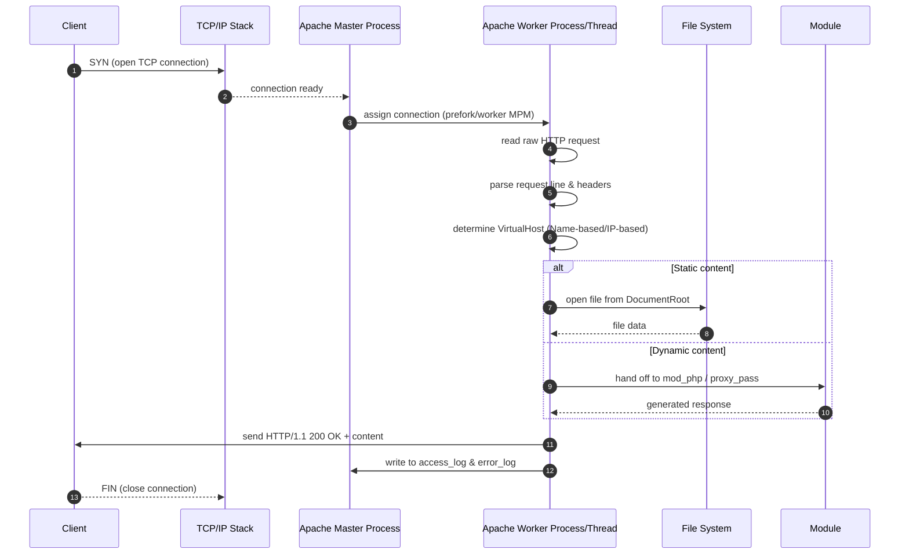
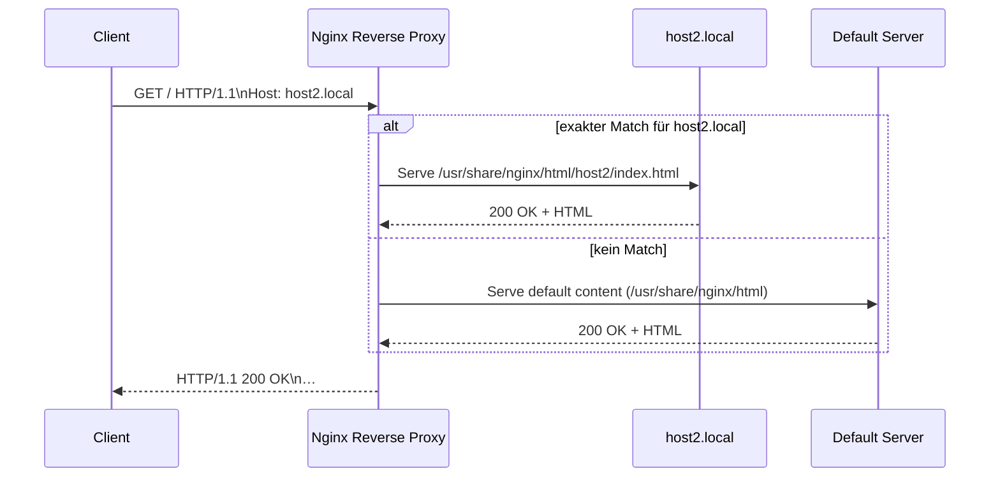

# Live Setup – Apache nativ & Nginx in Docker

---

## Setup & Ziele

Wir setzen zuerst einen nativen Apache‑Webserver auf und containerisieren anschließend Nginx mit drei virtuellen Hosts.
* Lernziele:

  1. Installation und Konfiguration eines Apache-Servers auf einem Linux-Host.
  2. Erstellung und Ausführung eines Docker‑Containers mit Nginx.
  3. Einrichten von Name-based Virtual Hosting mit Nginx.
* Voraussetzungen:

  * Ein Linux‑Server oder eine VM mit root-/sudo‑Rechten.
  * Installierte Basis-Tools: `apt` (Debian/Ubuntu) oder `yum` (RHEL/CentOS), `docker` und `git`.
  * Ein Terminal mit SSH-Zugang oder lokal auf der Maschine.
* Vorbereitung:

  ```bash
  # Debian/Ubuntu
  sudo apt update && sudo apt install -y curl docker.io
  # RHEL/CentOS
  sudo yum update && sudo yum install -y curl docker
  sudo systemctl start docker && sudo systemctl enable docker
  ```

---

## Apache nativ aufsetzen

### 1. Paketquellen aktualisieren

```bash
sudo apt update           # auf Debian/Ubuntu
# oder
sudo yum makecache fast    # auf RHEL/CentOS
```

### 2. Apache installieren

```bash
# Debian/Ubuntu
sudo apt install -y apache2
# RHEL/CentOS
sudo yum install -y httpd
```

### 3. Service starten und aktivieren

```bash
# Systemd
sudo systemctl start apache2   # httpd auf RHEL/CentOS
sudo systemctl enable apache2
```

### 4. Erste Überprüfung

* Standardseite abrufen:

  ```bash
  curl http://localhost
  ```
* Ausgabe sollte die Standard-Apache-Willkommensseite sein.

### 5. Verzeichnisstruktur & Konfiguration

* Document Root (Default): `/var/www/html`
* Default-Config:

  * Debian: `/etc/apache2/sites-available/000-default.conf`
  * RHEL: `/etc/httpd/conf/httpd.conf`
* Document Root anpassen (Beispiel):

```conf
  <VirtualHost *:80>
    ServerName www.example.local
    DocumentRoot /var/www/example
    <Directory /var/www/example>
      Options Indexes FollowSymLinks
      AllowOverride None
      Require all granted
    </Directory>
  </VirtualHost>
```

### 6. Virtuellen Host aktivieren (Debian/Ubuntu)

```bash
sudo mkdir -p /var/www/example
echo '<h1>Example Site</h1>' | sudo tee /var/www/example/index.html
sudo a2ensite 000-default.conf  # oder neuer vhost file
sudo systemctl reload apache2
```

### 7. Ablauf



### 8. Troubleshooting & Tipps

* Logs prüfen:

  * `/var/log/apache2/error.log` (Debian/Ubuntu)
  * `/var/log/httpd/error_log` (RHEL/CentOS)
* Firewall: `sudo ufw allow 80/tcp` bzw. `firewall-cmd --add-service=http --permanent && firewall-cmd --reload`

---

## Nginx in Docker mit 3 Virtual Hosts

### Konzept: Warum Docker?

* Konsistente Laufzeitumgebung auf allen Systemen
* Leichtere Rollbacks und Updates
* Sauberere Isolation

### 1. Projektstruktur anlegen

```bash
mkdir -p nginx-docker/{html,conf.d}
cd nginx-docker
```

### 2. Beispiel-Inhalte erstellen

```bash
# Host1
mkdir -p html/host1
echo '<h1>Host1</h1>' > html/host1/index.html

# Host2
mkdir -p html/host2
echo '<h1>Host2</h1>' > html/host2/index.html

# Host3
mkdir -p html/host3
echo '<h1>Host3</h1>' > html/host3/index.html
```

### 3. Nginx-Konfiguration für Virtual Hosts

Erstelle drei Dateien unter `conf.d`:

```nginx
# conf.d/host1.conf
server {
  listen 80;
  server_name host1.local;
  root /usr/share/nginx/html/host1;
}

# conf.d/host2.conf
server {
  listen 80;
  server_name host2.local;
  root /usr/share/nginx/html/host2;
}

# conf.d/host3.conf
server {
  listen 80;
  server_name host3.local;
  root /usr/share/nginx/html/host3;
}
```

### 4. Dockerfile erstellen

```dockerfile
FROM nginx:stable-alpine

# Konfiguration einbinden
COPY conf.d/ /etc/nginx/conf.d/
# Content einbinden
COPY html/ /usr/share/nginx/html/
```

### 5. Image bauen und Container starten

```bash
docker build -t my-nginx-demo .

docker run -d \
  --name nginx-demo \
  -p 8080:80 \
  -v $(pwd)/conf.d:/etc/nginx/conf.d:ro \
  -v $(pwd)/html:/usr/share/nginx/html:ro \
  my-nginx-demo
```

### 6. Überprüfung der Virtual Hosts

* Host-Header setzen:

  ```bash
  curl -H "Host: host2.local" http://localhost:8080
  ```
* Die jeweilige HTML-Seite (`<h1>Host2</h1>`) sollte angezeigt werden.

---

## Host-Header-Routing (Name-based Routing)

### Detaillierte Funktionsweise

Wenn ein HTTP-Request an einen Nginx-Server ankommt, enthält dieser den Host-Header, der angibt, unter welchem Domainnamen der Client die Ressource anfordert. Nginx nutzt diesen Header, um anhand der konfigurierten `server_name`-Einträge in allen `server`-Blöcken zu entscheiden, welcher virtuelle Host antworten soll.

1. **Client-Request**

   * Der Browser oder `curl` sendet eine Anfrage an `http://IP:Port`, z.B. `http://10.0.0.10:80`, mit folgendem Header:

     ```http
     GET / HTTP/1.1
     Host: host2.local
     ```
2. **Prüfung der `server_name`-Blöcke**

   * Nginx lädt alle Konfigurationsdateien unter `conf.d/` oder `sites-enabled/` und prüft die `server_name`-Directive jedes Blocks.
   * Die Reihenfolge der Prüfung ist: exakte Namen > Wildcards (`*.domain.local`) > reguläre Ausdrücke > erster definierter Block (`default_server`, falls angegeben).
3. **Auswahl des passenden Blocks**

   * Wird ein exakter Eintrag `host2.local` gefunden, wird dieser Block ausgewählt.
   * Gibt es mehrere Treffer, entscheidet die genaueste Übereinstimmung (Länge, exakter Host) oder der Block mit `default_server`.
4. **Bereitstellung des Dokuments**

   * Der ausgewählte Block weist auf ein `root`-Verzeichnis, z.B. `/usr/share/nginx/html/host2`, und Nginx liefert die angeforderte Datei zurück.
   * Fehlt eine spezifische Datei (z.B. `/` → `index.html`), greift das `index`-Directive oder es wird ein 404-Fehler ausgeliefert.

### Ablauf als Sequenzdiagramm



### Matching-Reihenfolge und Fallback

* **Exact Name**: `server_name host2.local;`
* **Wildcard**: `server_name *.local;`
* **Regular Expression**: `server_name ~^host\d+\.local$;`
* **Default Server**: Mit `listen 80 default_server;` gekennzeichneter Block, falls keine andere Regel greift.

### Zusätzliche Optionen

* **`listen [IP:]Port default_server;`**: Markiert einen Block als Fallback, wenn keine anderen `server_name`-Einträge passen.
* **`server_name_in_redirect off;`**: Verhindert, dass Nginx den Host-Header in Redirects einsetzt.
* **TLS/SNI**: Bei HTTPS wird das `server_name`-Indikatorfeld (SNI) im TLS-Handshake genutzt, um Zertifikat und virtuellen Host auszuwählen.

### Vorteile von Name-based Routing

* **Ressourcenschonend**: Mehrere Domains auf einer einzigen IP/Port-Kombination.
* **Flexibilität**: Schnelles Hinzufügen neuer Domains ohne zusätzliche IPs.
* **Einfaches SSL-Management**: Durch SNI können für jede Domain eigene Zertifikate verwendet werden.
* **Übersichtlichkeit**: Trennung der Konfiguration pro Site, leicht zu warten und zu deployen.


---

## Überleitung zu Domains

### Warum Domänennamen?

* **Menschenfreundlich**: Einfach zu merken, statt IPs.
* **DNS**: Verteiltes, fehlertolerantes System zur Namensauflösung.
* **Flexibilität**: Infrastruktur kann geändert werden, ohne URLs zu ändern.
* **SSL/TLS**: Zertifikatsausstellung und Verifikation über DNS/E-Mail.

## Live-Demo: /etc/hosts-Anpassung

Mit einer simplen Änderung der lokalen `hosts`-Datei können verschiedene Hostnamen auf `localhost` auflöst. So kann ein Docker-basierter Virtual Hosts ohne echte DNS-Einträge getestet werden.

### Was passiert hier?

1. **DNS-Override lokal:** Die Datei `/etc/hosts` dient als lokale Kurzliste für Domain-to-IP-Zuordnungen. Einträge dort haben Vorrang vor externen DNS-Servern.
2. **Hostnamen simulieren:** Indem wir `host1.local`, `host2.local` und `host3.local` alle auf `127.0.0.1` zeigen lassen, erreichen Request-Header mit diesen Namen unseren lokalen Rechner.
3. **Nginx im Docker-Container:** Unser Container lauscht am Port `8080` auf allen Interfaces. Mit dem passenden Host-Header entscheidet Nginx, welches Virtual-Host-Verzeichnis ausgeliefert wird.

### Schritt-für-Schritt

```bash
# 1. Backup der Originaldatei (optional, aber empfohlen)
sudo cp /etc/hosts /etc/hosts.backup

# 2. Eintrag für Test-Hosts hinzufügen
#    Wir hängen eine neue Zeile an, die drei Hostnamen auf 127.0.0.1 abbildet.
echo '127.0.0.1 host1.local host2.local host3.local' | sudo tee -a /etc/hosts

# 3. Test mit curl – Host-Header manuell setzen
#    Damit umgehen wir, dass curl standardmäßig nur localhost als Host nutzt.
curl -H "Host: host3.local" http://localhost:8080

# 4. Ausgabe prüfen
#    Die Antwort sollte den Inhalt aus /usr/share/nginx/html/host3/index.html liefern.
```

### Warum `tee -a` und nicht direkt editieren?

* `sudo echo '...' >> /etc/hosts` funktioniert nicht, da `>>` vom nicht-privilegierten Shell-Prozess ausgeführt wird.
* Mit `sudo tee -a` schreiben wir unter Root-Rechten sicher ans Ende der Datei.

### Wichtige Hinweise

* **Rechte und Sicherheit:** `/etc/hosts` darf nur von Root bearbeitet werden. Achte darauf, keine bestehenden wichtigen Einträge zu überschreiben.
* **Rollback:** Sollten später Probleme auftreten, kannst du das Backup zurückspielen:

  ```bash
  sudo mv /etc/hosts.backup /etc/hosts
  ```
* **Mehrfache Tests:** Für `host1.local` und `host2.local` kannst du analog testen:

  ```bash
  curl -H "Host: host1.local" http://localhost:8080
  curl -H "Host: host2.local" http://localhost:8080
  ```

Mit dieser Methode kann man Virtual Hosts bequem lokal simulieren, bevor echte DNS-Einträge oder Live-Domains genutzt werden.

### Ausblick: Produktion & echte Domains

* Domain-Registrierung (z.B. über Registrare wie IONOS, GoDaddy)
* DNS-Einträge (A, CNAME)
* Automatisierung mit Let's Encrypt + Certbot
* CI/CD-Integration für Config-Updates

---

## Gegenüberstellung Apache und Nginx

| Merkmal                              | Apache                                                                 | Nginx                                                                                   |
|--------------------------------------|------------------------------------------------------------------------|-----------------------------------------------------------------------------------------|
| **Architektur**                      | Prozess-basiert (prefork, worker, event)                                | Ereignisgesteuert (asynchron, non-blocking)                                            |
| **Prozessmodell**                    | Pro-Connection ein Thread/Prozess                                       | Ein Master-Prozess mit vielen Worker-Prozessen, die hunderte Verbindungen bedienen      |
| **Konfigurationsdateien**            | `/etc/apache2/apache2.conf`, `sites-available/*.conf`                  | `/etc/nginx/nginx.conf`, `conf.d/*.conf`                                                |
| **Leistung**                         | Gut bei moderater Last, kann bei hoher Parallelität mehr Ressourcen nutzen | Sehr effizient bei hohen Verbindungszahlen, niedrige Latenz und geringer Overhead      |
| **Speicherbedarf**                   | Höher, da pro Request eigener Prozess/Thread                            | Niedriger, da asynchrones Modell                                                         |
| **Statische Inhalte**                | Schnell, aber weniger optimiert als Nginx                               | Sehr schnell, optimiertes Caching und Direct Serving                                    |
| **Dynamische Inhalte**               | Integration via mod_php, mod_perl, mod_python direkt im Server          | Über FastCGI, uWSGI, proxy_pass an Backend-Prozesse                                      |
| **Virtual Hosts**                    | Name- und IP-basiert, leicht per `.conf`-Dateien konfigurierbar         | Name- und IP-basiert, einfache include-Struktur in `conf.d/`                            |
| **SSL/TLS**                          | mod_ssl, Konfiguration pro VirtualHost                                  | eingebaut, sehr performant, SNI-Unterstützung                                           |
| **Reverse Proxy & Load Balancing**   | über mod_proxy, mod_proxy_balancer                                       | nativ, sehr flexibel (Round Robin, Least Connections, IP Hash, Health Checks)           |
| **Module / Erweiterbarkeit**         | Zahlreiche Module, dynamisch ladbar                                     | Kern + wenige externe Module, weniger umfangreich, aber viele Third-Party-Module        |
| **Verwaltung / API**                 | CGI, mod_status, mod_info                                               | HTTP-API via Stub Status Modul, einfache Metrics                                        |
| **Fehlertoleranz & Hot Reload**      | Graceful Restart möglich, aber langsamer Reload                         | Blauer/Grüner Prozesswechsel, nahtloses Reload ohne Drop                              |
| **Logging**                          | Access/Error Logs pro VirtualHost                                       | Access/Error Logs, plus integriertes `error_log`-Level Management                       |
| **Community & Support**              | Sehr lange Historie, große Community, viele Tutorials                   | Wachsende Community, moderne Dokumentation, häufig in Cloud-Umgebungen eingesetzt       |
| **Typische Verwendungsfälle**        | Legacy-Apps, komplexe .htaccess-Regeln, modulare Erweiterungen          | High-Performance-Proxy, CDN-Edge-Server, Container-Umgebungen, statische Sites, API-Gateway |

